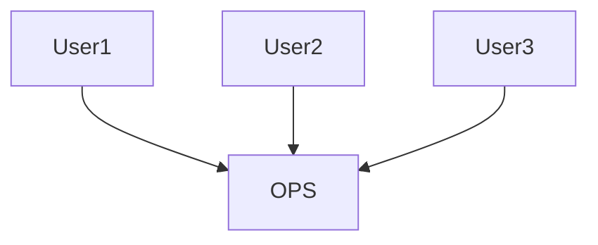
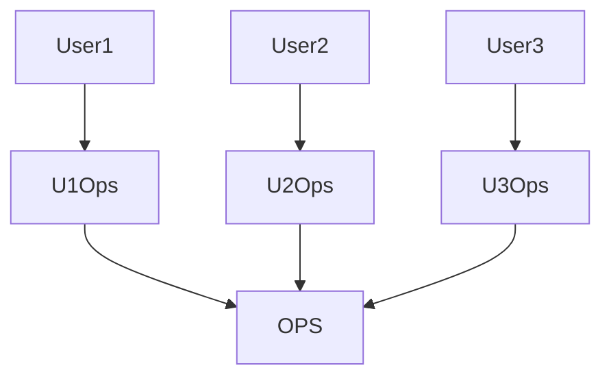
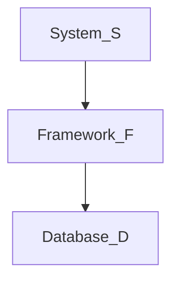

# 10장 ISP: 인터페이스 분리 원칙

여러 사용자가 OPS 클래스를 사용한다고 가정하자. User1은 op1을, User2는 op2, User3은 op3 기능을 사용한다.

이때 op2 코드가 변경되면 User1도 다시 컴파일한 후 배포해야 한다. User1이 사용하는 op1은 변경이 없었는데도 말이다.

이러한 문제는 오퍼레이션을 인터페이스 단위로 분리해서 해결할 수 있다.

## ISP와 언어

위의 예제는 언어 타입에 의존한다. 정적 타입 언어는 `import`, `use`, `include`와 같은 타입 선언문을 강제로 사용한다. 이로 인해 소스 코드 의존성이 발생하고 재컴파일 또는 재배포가 강제된다.

루비나 파이썬 같은 동적 타입 언어에는 선언문이 존재하지 않고 런타임에 타입 추론을 한다. 따라서 소스 코드에 의존성이 아예 없고 재컴파일 또는 재배포가 필요없다. 이렇기 때문에 동적 타입 언어를 사용하면 유연하고 결합도 낮은 시스템을 만들 수 있는 것이다.

## ISP와 아키텍처

아키텍처 수준에서도 동일하다. 일반적으로 필요 이상으로 많은 걸 포함하는 모듈에 의존하는 것은 해로운 일이다.

S와 전혀 관계 없는 기능이 D에 포함되어있다고 가정할 때, D의 변경이 F, S의 재배포로 이어질 수 있다.

## 결론

불필요한 무언가에 의존하면 예상치 못한 문제에 빠질 수 있다.