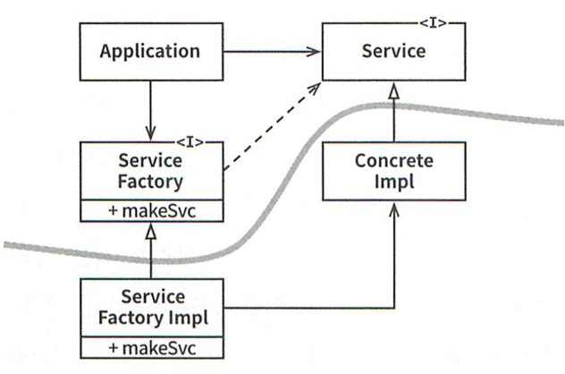

# 11장 DIP: 의존성 역전 원칙

유연성이 극대화된 시스템이란 소스 코드 의존성이 **추상(abstraction)** 에 의존하고 **구체(concretion)** 에는 의존하지 않는 시스템이다.

자바와 같은 정적 타입 언어에서 인터페이스나 추상 클래스 같은 추상적인 타입만 참조해야 한다는 뜻이다. 하지만 루비나 파이썬같은 동적 타입 언어에선 구체 모듈이 무엇인지 정의하기 다소 어렵다. 소프트웨어 시스템은 구체적인 장치에 반드시 의존하기 때문이다.

java.lang.String 클래스도 구체적인 클래스라고 할 수 있다. 하지만 String 클래스는 매우 안정적이고 변경되는 일이 거의 없으며 엄격하게 통제된다. 그래서 DIP를 논할 때 운영체제나 플랫폼 같이 안정성이 보장된 환경은 무시한다. 우리가 의존을 피하고자 하는 것은 변동성이 큰 구체적인 요소이다.

## 안정된 추상화

안정된 소프트웨어 아키텍처란 변동성이 큰 구현체에 의존하는 것을 지양하고 안정적인 추상 인터페이스에 의존하는 것을 선호하는 아키텍처다.

### 코딩 실천법

- 변동성이 큰 구체 클래스를 참조하지 말라
  - 구체 클래스 대신 대신 추상 인터페이스를 참조
  - 객체 생성 방식을 추상 팩토리(Abstract Factory)를 사용하도록 강제
- 변동성이 큰 구체 클래스로부터 파생하지 말라
  - 정적 타입 언어에서 상속은 가장 강력하지만 뻣뻣해서 변경하기 어려움
- 구체 함수를 오버라이드 하지 말라
  - 구체 함수를 오버라이드 하면 의존성을 제거할 수 없게 되며 그 의존성을 상속하게 됨
  - 추상 함수로 선언하고 구현체들에서 각자 용도에 맞게 구현
- 구체적이며 변동성이 크다면 절대로 그 이름을 언급하지 말라

## 팩토리

위 규칙들을 준수하려면 변동성이 큰 구체적인 클래스는 주의해서 생성해야 한다. 객체를 생성할 때 의존성이 생기는데 이때 추상 팩토리를 사용한다.

Application은 ConcreteImpl을 사용한다. 소스 코드 의존성을 만들지 않으면서 ConcreteImpl을 사용하기 위해 Application은 ServiceFactory 인터페이스의 makeSvc 메서드를 호출한다. makeSvc 메서드는 ServiceFactoryImpl에서 구현된다. ServiceFactoryImpl은 ConcreteImpl을 생성한 후 Service 타입으로 반환한다.

곡선은 아키텍처 경계를 뜻한다. 곡선 위쪽은 추상 컴포넌트이고 아래쪽은 구체 컴포넌트이다. 추상 컴포넌트는 고수준의 비즈니스 규칙을 포함하기 때문에 제어 흐름은 코드 의존성과는 반대로 역전된다. 이러한 이유로 **의존성 역전(Dependency Inversion)** 이라고 부른다.

## 구체 컴포넌트

위 그림에서 ServiceFactoryImpl은 ConcreteImpl을 의존한다. 즉, 구체적인 의존성이 존재한다. 이것은 일반적인 것이다. **모든 클래스를 DIP를 지키도록 할순 없다.** 하지만 DIP를 위배하는 클래스는 적은 수의 구체 컴포넌트 내부로 모아서 시스템의 나머지 부분과 분리할 수 있다.

## 결론

그림에서 나온 곡선은 아키텍처 경계가 된다. 의존성은 곡선을 경계로 더 추상적인 엔티티가 있는 쪽으로만 향한다.