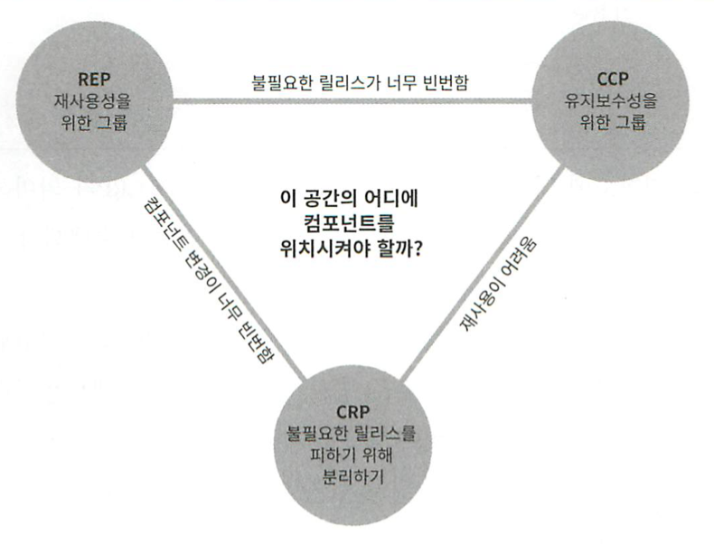

# 13장 컴포넌트 응집도

이 장에선 컴포넌트 응집도와 관련된 3가지 원칙을 논의한다.

- REP(Reuse/Release Equivalence Principle): 재사용/릴리스 등가 원칙
- CCP(Common Closure Principle): 공통 폐쇄 원칙
- CRP(Common Reuse Principle): 공통 재사용 원칙

## REP: 재사용/릴리스 등가 원칙

> 재사용 단위는 릴리스 단위와 같다.

릴리스 번호가 없다면 재사용 컴포넌트들이 서로 호환되는지 보증할 방법이 없다. 그리고 새로운 버전이 언제 출시되고 무엇이 변경되었는지 개발자들이 알아야 하기 때문이다.

이 원칙을 아키텍처 관점에서 보면 단일 컴포넌트는 응집성 높은 클래스와 모듈들로 구성되어야 한다는 것을 의미한다. 하나의 컴포넌트로 묶인 클래스와 모듈은 버전 번호가 같아야 하며, 동일한 릴리스로 추적 관리되고, 동일한 릴리스 문서에 포함되어야 한다.

REP만으론 클래스와 모듈을 단일 컴포넌트로 묶는 방법을 제대로 설명하기 힘들다. 앞으로 나오는 CCP, CRP를 통해 이를 보완할 수 있다.

## CCP: 공통 폐쇄 원칙

> 동일한 이유로 동일한 시점에 변경되는 클래스를 같은 컴포넌트로 묶고, 서로 다른 시점에 다른 이유로 변경되는 클래슨느 다른 컴포넌트로 분리해야 한다.

CCP는 단일 책임 원칙(SRP)을 컴포넌트 관점에서 다시 쓴 것이다.

대다수 애플리케이션에서 유지보수성은 재사용성보다 더 중요하다. 코드 변경이 일어날 때 변경이 여러 컴포넌트에 분산되어 발생하기 보다는 모든 변경이 단일 컴포넌트에서 발생하는 편이 낫다. 그러면 변경이 일어났을 때도 해당 컴포넌트만 재배포하면 된다.

같은 이유로, 물리적 또는 개념적으로 강하게 결합되어 함께 변경되는 클래스들은 하나의 컴포넌트에 속해야 한다.

CCP는 개방 폐쇄 원칙(OCP)과도 밀접한 관련이 있다. 발생할 가능성이 있는 공통적인 변경 사항에 대해 한 컴포넌트로 묶음으로써 변경의 영향도를 최소화한다.

##  CRP: 공통 재사용 원칙

> 컴포넌트 사용자들을 필요하지 않는 것에 의존하게 강요하지 말라.

공통 재사용 원칙(CRP)도 클래스와 모듈을 어떤 컴포넌트에 위치시킬 것인지 결정하는데 도움을 주는 원칙이다. 대부분 클래스는 개별 클래스가 아닌 재사용 가능한 클래스로 모듈의 일부로써 상호작용한다. 이들 클래스는 반드시 동일한 컴포넌트에 위치해야 한다.

또, 어떤 컴포넌트가 다른 컴포넌트를 사용하면 단 하나의 클래스만 사용하더라도 의존성이 생긴다. 이 의존성으로 인해 컴포넌트가 변경될 때마다 사용하는 컴포넌트도 변경해야할 가능성이 높다. 따라서 **의존하는 컴포넌트가 있다면 해당 컴포넌트의 모든 클래스에 대해 의존한다는 것을 확실하게 인지해야 한다.**

다른 컴포넌트의 일부 클래스만 의존할 수 없기 때문에 꼭 필요한 클래스만 컴포넌트에 포함되어야 하고 필요 없는 클래스는 컴포넌트에 포함하면 안된다. 

### ISP와의 관계

CRP는 인터페이스 분리 원칙(ISP)의 포괄적인 버전이다. ISP는 사용하지 않는 메소드가 있는 클래스에 의존하지 말라고 한다. CRP는 사용하지 않는 클래스를 가진 컴포넌트에 의존하지 말라고 한다. 두 원칙은 한 문장으로 요약할 수 있다.

> 필요하지 않은 것에 의존하지 말라.

## 컴포넌트 응집도에 대한 균형 다이어그램

응집도에 관한 세 원칙은 서로 상충된다.

- REP, CCP는 포함 원칙으로 컴포넌트를 더 크게 만든다.
- CRP는 배제 원칙으로 컴포넌트를 더 작게 만든다.

뛰어난 아키텍트라면 원칙들이 균형을 이루는 방법을 찾아야 한다.

각 변은 반대쪽에 있는 원칙을 포기했을때 감수해야할 비용을 나타낸다.

뛰어난 아키텍트라면 개발팀이 현재 주의를 기울이는 부분을 충족시키는 위치를 찾아야하고, 시간이 흐르면서 개발팀이 주의를 기울이는 부분도 변한다는 사실을 이해하고 있어야 한다.

일반적으로 프로젝트 초기엔 삼각형의 오른쪽(CCP)가 더 중요하다. 이때는 재사용성만 희생하면 된다. 프로젝트가 성숙해지면 중요도는 삼각형의 왼쪽으로 점점 이동한다. 즉, 프로젝트의 컴포넌트 구조는 시간과 성숙도에 따라 변한다는 뜻이다.

## 결론

어떤 클래스들을 묶어서 컴포넌트로 만들지 결정할 때, 재사용성과 개발 가능성이라는 상충하는 요소를 반드시 고려해야 한다.

이들 사이에서 요구 사항에 맞게 균형을 잡아야한다. 그리고 균형점이 유동적이라서 시간의 흐름에 따라 변한다.
