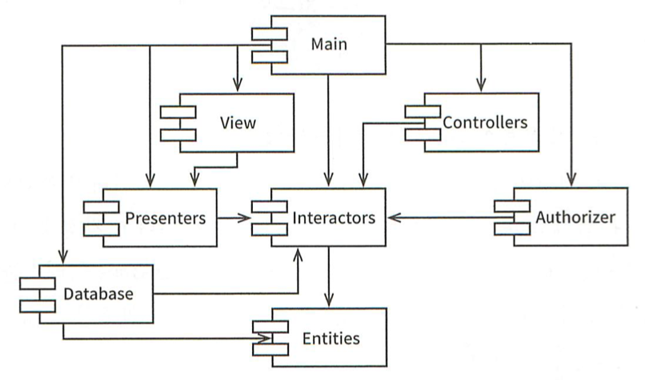

# 14장 컴포넌트 결합

## ADP: 의존성 비순환 원칙

> 컴포넌트 의존성 그래프에 순환(cycle)이 있어서는 안 된다.

많은 개발자가 동일한 소스 파일을 수정하게 되면 코드가 망가진다. 프로젝트 규모가 커질수록 더욱 그렇다. 동작하게 만들고 퇴근하면 다음날 동작하지 않는 것을 숙취 증후군(the morning after syndrome)이라고 한다. 

숙취 증후군은 2가지 해결책이 있다. 주 단위 빌드(weekly build)와 의존성 비순환 원칙(Acyclic Dependencies Principle, ADP)이다.

### 주 단위 빌드

중간 규모의 프로젝트에서 흔하게 사용된다. 모든 개발자가 4일동안은 서로를 신경 쓰지 않고 작업한다. 이후 금요일이 되면 변경된 코드를 모두 통합해 시스템을 빌드한다.

시스템의 규모가 커지면 금요일 하루만에 마칠 수 없게 되고 점점 비효율적으로 변해 빠른 피드백이 주는 장점을 잃게 된다.

### 순환 의존성 제거하기

개발 환경을 릴리즈 가능한 컴포넌트 단위로 분리하면 이 문제를 해결할 수 있다. 컴포넌트는 개별 개발자나 단일 개발팀이 작업해서 다른 개발팀이 사용할 수 있도록 만들면 특정 컴포넌트가 변경되더라도 다른 팀에 바로 영향을 주진 않는다.

이 방식이 성공적으로 동작하려면 컴포넌트 사이에 순환이 있으면 안된다. 반드시 의존성 구조를 관리해야한다.

위 구조는 비순환 방향 그래프(Directed Acyclic Graph, DAG)로 어떤 컴포넌트에서 시작하더라도 최초의 컴포넌트로 돌아갈 수 없다. 그리고 컴포넌트의 릴리즈에 영향을 받는 팀도 쉽게 찾을 수 있다. 의존성 화살표를 거꾸로 따라가면 된다.

시스템 전체를 릴리즈할 경우 릴리즈 순서는 상향식으로 진행한다. `Entities` 컴포넌트를 컴파일, 테스트 후 릴리즈한다. 이후 `Database`와 `Interactors`, 이후 `Presenters`, `View`, `Controller`, `Authorizer` 순으로 진행한다.

### 순환이 컴포넌트 의존성 그래프에 미치는 영향

`Entities`의 `User` 클래스가 `Authorizer`의 `Permissions` 클래스를 사용한다고 가정하면 다음과 같이 순환이 생겨버린다. 이 경우 세 컴포넌트는 사실상 하나의 거대한 컴포넌트가 되어 버린다. 해당 컴포넌트의 개발자들은 숙취 증후군을 겪게 된다.

`Entities` 컴포넌트를 테스트할 때 `Authorizer`와 `Interactors`까지 빌드하고 통합해야한다. 빌드, 테스트 뿐만 아니라 릴리즈도 어려워지고 에러도 쉽게 발생한다.

### 순환 끊기

컴포넌트 사이의 순환을 끊고 다시 DAG로 원상복구를 해야한다. 방법은 다음과 같다.

1. 의존성 역전 원칙(DIP)을 적용한다.

   - 

     `Permissions` 인터페이스를 `Entities`에 위치시켜 의존성을 역전시켜서 순환을 끊는다.

2. Entities와 Authorizer가 의존하는 새로운 컴포넌트를 만들고 두 컴포넌트가 모두 의존하는 클래스들을 새로운 컴포넌트로 이동시킨다.

   - 

### 흐트러짐(Jitters)

두 번째 해결책은 요구사항이 변경되면 컴포넌트 구조도 변경될 수 있다는 것을 시사한다. 따라서 의존성 구조에 순환이 발생하는지 항상 관찰하고 순환이 발생하면 어떤 식으로든 끊어야 한다.

## 하향식(top-down) 설계

즉 컴포넌트 구조는 하향식으로 설계될 수 없다. 컴포넌트는 시스템에서 가장 먼저 설계할 수 있는 대상이 아니며 시스템이 성장하고 변경될 때 함께 진화한다.

일반적으론 컴포넌트 구조가 시스템의 기능적인 측면을 표현한다고 생각하지만 컴포넌트 의존성 다이어그램과 애플리케이션의 기능은 거의 관련이 없다. 오히려 컴포넌트 의존성 다이어그램은 애플리케이션의 빌드 가능성(buildability)과 유지보수성(maintainability)을 보여주는 지도와 같다. 이러한 이유로 컴포넌트 구조는 프로젝트 초기에 설계할 수 없는 것이다.

빌드나 유지보수할 일이 없다면 빌드와 유지보수의 지도 또한 필요 없다. 하지만 프로젝트 규모가 점점 커지면서 모듈들이 쌓이기 시작하면, 숙취 증후군을 겪지 않기 위해 의존성 관리에 대한 요구가 점점 늘어난다.

결국 컴포넌트 의존성 그래프는 자주 변경되는 컴포넌트로부터 안정적이고 가치가 높은 컴포넌트를 보호하는 아키텍처를 만들게 된다. 아무런 클래스도 없는 상태에서 컴포넌트 의존성 구조를 설계하려고 시도한다면 큰 실패를 맛볼 수 있다.

## SDP: 안정된 의존성 원칙

> 안정성의 방향으로(더 안정된 쪽에) 의존하라.

설계는 결코 정적일 수 없다. 설계를 유지하다 보면 변경은 불가피하다. 따라서 변경이 쉽지 않은 컴포넌트가 변동이 많은 컴포넌트에 의존하게 만들어선 안된다. 한번 의존하게 되면 변동이 많은 컴포넌트도 결국 변경이 어려워진다.

당신이 모듈을 만들 때는 변경하기 쉽도록 설계했지만, 이 모듈에 의존성을 매달아 버리면 당신의 모듈도 변경하기 어려워진다. 안정된 의존성 원칙(SDP)을 통해 변경이 어려운 모듈이 변경하기 쉽게 만들어진 모듈에 의존하지 않게 할 수 있다.

### 안정성

안정성(stability)이란 무슨 뜻인가? 안정성은 변화가 발생하는 빈도와는 직접적인 관련이 없다. **안정성은 변경을 만들기 위해 필요한 작업량과 관련된다.**

컴포넌트를 향한 의존이 많아지면 사소한 변경이라도 의존하는 모든 컴포넌트를 수정해야 하기 때문에 안정적이라고 볼 수 있다. 다음과 같은 X 컴포넌트는 안정적인 컴포넌트이다. 이때 X는 세 컴포넌트를 책임진다(responsible)고 할 수 있고, X는 독립적이다(independent)고 할 수 있다.

반면 Y는 불안정한 컴포넌트다. 변경이 발생할 수 있는 외부 요인이 세 가지다. Y는 의존적이라고 한다.

### 안정성 지표

컴포넌트로 들어오고 나가는 의존성 개수를 통해 안정성을 측정할 수 있다.

- Fan-in : 안으로 들어오는 의존성 (클래스 개수)
- Fan-out : 밖으로 나가는 의존성 (클래스 개수)
- I(불안정성) : `I = Fan-out / (Fan-in + Fan-out)`

이러한 의존성은 C++의 경우 `#include`문, 자바의 경우 `import` 구문을 통해 표현된다.

I 값이 1이면 최고로 불안정한 상태다. 이 컴포넌트는 변경하지 말아야 할 이유가 없다.

반대로 I 값이 0이면 최고로 안정한 상태다. 해당 컴포넌트는 변경하기 어렵지만 해당 컴포넌트를 변경하도록 강제하는 의존성은 없다.

SDP에서는 컴포넌트 지표가 그 컴포넌트가 의존하는 다른 컴포넌트의 지표보다 커야한다. 즉, 의존성 방향으로 갈수록 I 값이 감소해야 한다.

### 모든 컴포넌트가 안정적이어야 하는 것은 아니다.

모든 컴포넌트가 최고로 안정적인 시스템이라면 변경이 부락능하다. 이것은 바람직한 상황이 아니다. 다음과 같이 불안정한 컴포넌트와 안정된 컴포넌트가 공존해야 한다.

불안정한 컴포넌트를 위에 두어서 위로 향하는 화살표가 있는지 여부를 통해 SDP를 위배하는지 확인할 수 있다.

다음은 SDP가 위배된 사례다. Stable 컴포넌트에서 Flexible 컴포넌트에 의존성이 생기게 되었다.

이로 인해 Flexible은 변경하기 어렵게 되었다. 이 문제를 해결하기 위해선 Stable -> Flexible의 의존성을 어떤 식으로든 제거해야 한다.

DIP를 도입해 이 문제를 해결할 수 있다. UServer 컴포넌트를 추가하고, US 인터페이스를 해당 컴포넌트에 배치시켜서 Stable 컴포넌트에서 구현하게 하면 Stable -> Flexible의 의존성을 끊을 수 있고 두 컴포넌트 모두 UServer에 의존하도록 강제할 수 있다.

### 추상 컴포넌트

오로지 인터페이스만을 포함하는 컴포넌트를 말한다(여기선 UServer). 추상 컴포넌트는 상당히 안정적이라서 덜 안정적인 컴포넌트가 의존할 수 있는 이상적인 대상이다.

## SAP: 안정된 추상화 원칙

> 컴포넌트는 안정된 정도만큼만 추상화되어야 한다.

### 고수준 정책을 어디에 위치시켜야 하는가?

고수준 정책은 반드시 안정된 컴포넌트에 위치해야 한다.

하지만 고수준 정책을 안정된 컴포넌트에 위치시키면 해당 정책을 포함하는 소스 코드는 수정하기 어려워지고 시스템이 유연성을 잃는다. 이때 개방 폐쇄 원칙(OCP)에서 해답을 찾을 수 있다. 클래스를 수정하지 않고 확장할 수 있다. 어떤 클래스가 이 원칙을 준수할 수 있을까? 바로 추상 클래스다.

### 안정화된 추상화 원칙

안정화된 추상화 원칙(SAP)은 안정성(stability)과 추상화(abstractness) 정도의 관계를 정의한다.

안정된 컴포넌트는 추상 컴포넌트와 인터페이스로 구성되어야 하며, 추상 컴포넌트를 통해 안정성이 컴포넌트를 확장하는 일을 방해해선 안된다. 반면 불안정한 컴포넌트는 반드시 구체 컴포넌트여야 한다. 컴포넌트가 불안정하기 때문에 구체적인 코드를 쉽게 변경할 수 있어야 하기 때문이다.

**SAP와 SDP를 결합하면 컴포넌트에 대한 DIP가 된다**. SDP는 의존성의 방향이 안정적인 방향이어야 한다고 말하고, SAP에선 안정성이 결국 추상화를 의미한다고 말하기 때문이다. 따라서 의존성이 추상화의 방향으로 향한다.

### 추상화 정도 측정하기

A 지표는 컴포넌트의 추상화 정도를 측정한 값이다. 클래스 개수 대비 인터페이스와 추상 클래스의 개수를 계산한 값이다.

A가 0이면 컴포넌트엔 추상 클래스가 없다는 뜻이고, 1이면 오로지 추상 클래스만 포함한다는 뜻이다.

### 주계열

다음 그래프는 안정성(I)과 추상화 정도(A) 사이의 관계를 나타낸다.

안정적이고 추상화된 컴포넌트는 좌측 상단(0, 1)에 위치하며, 불안정하고 구체화된 컴포넌트는 우측 하단(1, 0)에 위치한다.

모든 컴포넌트가 (0, 1) 또는 (1, 0)에 위치할 순 없다.

### 고통의 구역

(0, 0) 주변의 컴포넌트는 안정적이지만 구체적이다. 추상적이지 않아서 확장할 수 없고, 안정적이라서 변경하기 어렵다. 이곳을 고통의 구역이라고 부르는데 제대로 설계된 컴포넌트는 고통의 구역에 위치하지 않는 것이 일반적이다.

데이터베이스 스키마의 경우 예외적으로 고통의 구역에 위치한다. 이러한 이유로 스키마가 변경은 고통을 수반한다. 또 다른 경우는 유틸리티 라이브러리가 있다. 하지만 유틸리티 라이브러리의 경우 안정성(I)이 1이라도 변경될 일이 거의 없다.

### 쓸모없는 구역

(1, 1) 주변의 컴포넌트는 최고로 추상적이지만 누구도 해당 컴포넌트에 의존하지 않는다. 그래서 쓸모가 없다.

### 배제 구역 벗어나기

따라서 변동성이 큰 컴포넌트는 앞서 말한 두 베재 구역으로부터 멀리 떨어뜨려야 한다. 이것을 주 계열(main sequence)이라고 한다.

주 계열에 위치한 컴포넌트는 너무 추상적이지도 않고 너무 불안정하지도 않다. 컴포넌트가 위치할 수 있는 가장 바람직한 지점은 주 계열의 두 종점이다.

### 주계열과의 거리

컴포넌트가 주 계열과 얼마나 멀리 떨어져있는지 측정해서 컴포넌트를 검토할 수 있다.

- D : `D = |A + I - 1|`
  D가 0이면 주계열 바로 위에 위치하는 것이고, 1이면 주계열로부터 가장 멀리 위치하는 것이다.

D의 값이 표준편차(Z)가 1인 영역을 벗어난 컴포넌트는 검토해봐야 한다.

## 결론

의존성 관리 지표를 통해 얼마나 잘 부합하는지 측정할 수 있다. 하지만 지표는 측정값에 지나지 않기 때문에 절대적인 것이 아니다.