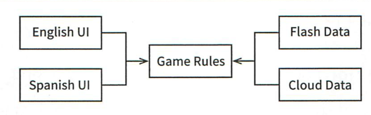
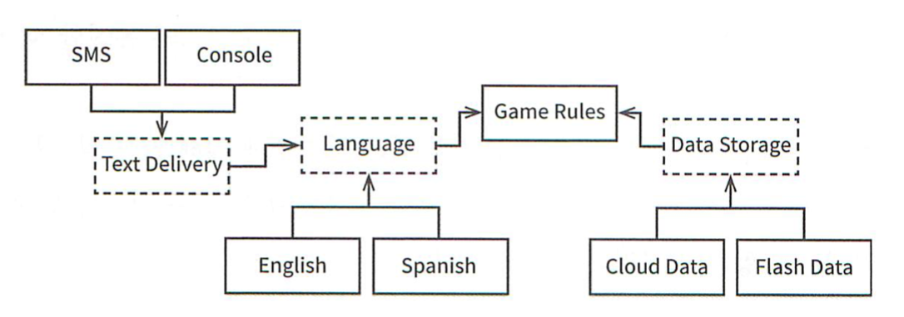
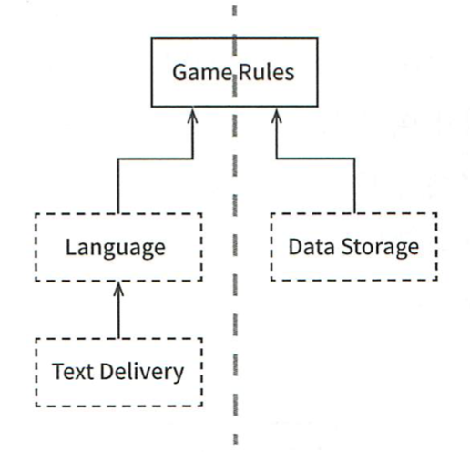
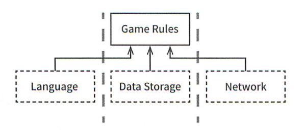
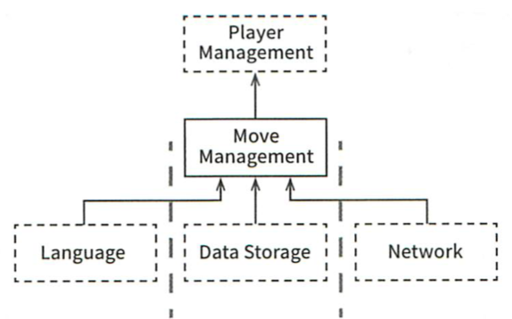
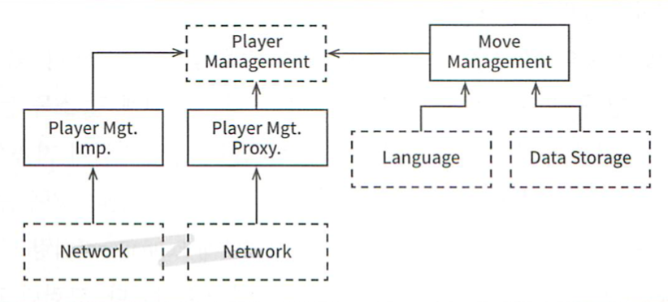

# 25장 계층과 경계

## 움퍼스 사냥 게임

간단한 컴퓨터 게임을 상상해보자. 플레이어에게 텍스트로 명령을 입력받아 움퍼스를 사냥한다.

텍스트 기반의 UI를 게임 규칙과 분리해서 API로 통신하면 게임 규칙을 재사용할 수 있다. UI 부분이 분리되어 훗날 다양한 언어로 발매할 수 있도록 만들 수 있다.

또한 게임 규칙이 다양한 데이터 저장소에 대해 알지 못하게 의존성을 방향을 역전하면 다음과 같은 구조가 된다.

## 클린 아키텍처?

이정도 규모의 예제에선 클린 아키텍처 접근법을 이용해 유스케이스, 경계, 엔티티, 데이터 구조를 만드는 것은 쉬운 일이다. 과연 아키텍처 경계를 모두 발견한 것일까?

UI에서 언어 뿐만 아니라 다양한 변경 사항이 있을 수 있다. 텍스트를 주고 받는 것이 셸(shell) 창이 될 수도 있고 채팅창이 될 수도 있다. 그리고 이 변경에 의해 정의되는 아키텍처 경계가 잠재되어있을 수도 있다.

이러한 부분까지 고려해서 개선된 다이어그램은 다음과 같다.

여기서 점선으로 된 테두리는 추상 컴포넌트를 말하고 이에 대한 구현은 추상컴포넌트 위, 아래에 있는 컴포넌트에서 한다.

구현 컴포넌트들은 추상 API 컴포넌트가 정의하는 다형성 인터페이스를 통해 제공된다. API 컴포넌트에만 집중하면 다이어그램을 단순화할 수 있다.

다이어그램의 모든 화살표는 위를 향하고 GameRules가 최상위에 놓인다. GameRules는 최상위 수준의 정책을 갖고 있기 때문에 적합한 배치이다.

사용자의 입력은 TextDelivery, Language를 거쳐 GameRules에서 처리된 후 DataStorage로 데이터를 내려보낸다. 이 구성은 데이터 흐름을 두개의 흐름으로 효과적으로 분리한다.

## 흐름 횡단하기

데이터 흐름은 항상 두 가지일까? 아니다. 움퍼스 사냥 게임을 네트워크상에서 여러 사람이 함께 플레이할 수 있게 된다면 데이터 흐름은 3개의 흐름이 되고 이 흐름들은 모두 GameRules가 제어한다.

시스템이 복잡해질수록 컴포넌트 구조는 더 많은 흐름으로 분리될 것이다.

## 흐름 분리하기

모든 흐름이 상단의 단일 컴포넌트에서 만난다고 생각할 수도 있다. 하지만 이보다 더 높은 수준엔 또 다른 정책 집합이 존재한다.

`MoveManagement`와 같은 저수준 메커니즘 정책에선 고수준 정책에게 `FoundFood`(식량 발견)과 같은 사건이 발생했다는 것을 알리고 고수준 정책에선 플레이어의 상태를 관리한다.

여기에 마이크로서비스까지 추가해서 대규모의 사용자가 동시에 플레이할 수 있다고 가정해보면 `PlayerManagement`는 `MoveManagement` 컴포넌트에 마이크로서비스 API를 제공한다. 그러면 다음과 같이 `PlayerManagement`와 `MoveManagement` 사이에 완벽한 형태의 아키텍처 경계가 존재하게 된다.

## 결론

간단한 프로그램에서 이렇게 아키텍처 경계를 모두 추론해내는 이유는 **아키텍처 경계가 어디에나 존재한다**는 사실을 보여주기 위함이다. 우리는 아키텍처 경계가 언제 필요한지 파악해야 한다. 또한 아키텍처 경계를 제대로 구현하려면 많은 비용이 드는 사실도 인지해야 한다.

우리는 추상화가 필요할 것이라고 미리 예측해서는 안된다. 이것이 YAGNI(You Aren't Going to Need it)가 말하는 철학이다. 오버엔지니어링(over engineering)이 언더 엔지니어링(under engineering)보다 나쁠 때가 훨씬 더 많다.

소프트웨어 아키텍트는 미래를 내다보고 현명하게 추측해야 한다. 그리고 **완벽하게 구현할 경계와 무시할 경계가 무엇인지 결정**해야 한다.

프로젝트 초반엔 구현할 경계와 무시할 경계를 쉽게 결정할 수 없다. 이땐 지켜봐야 한다. 경계가 존재하지 않아 생기는 마찰의 조짐을 관찰한다. 조짐이 보이는 시점이 되면 경계를 구현하는 비용과 무시할때 감수할 비용을 가늠해서 구현의 비용이 적어지는 시점에 구현한다.
